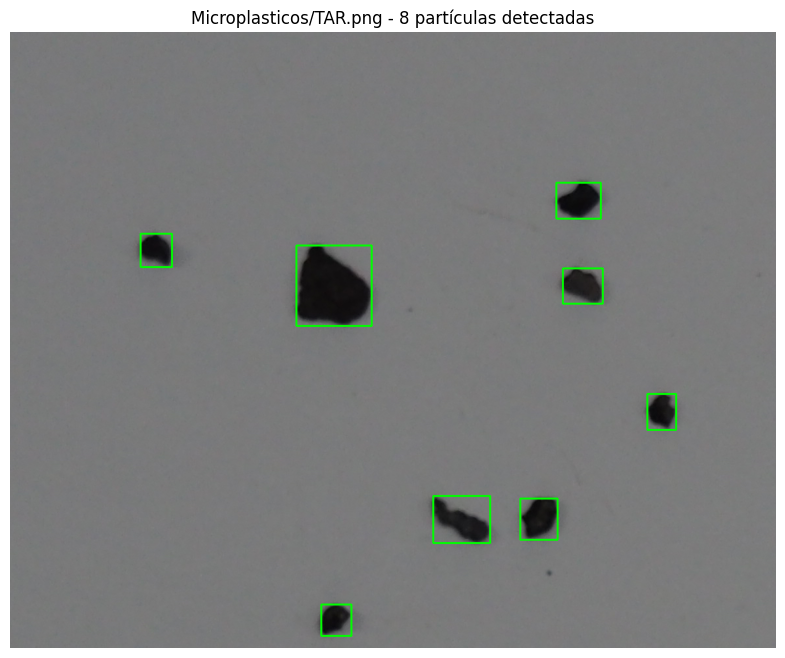

# Práctica 3 - Visión por Computador

## Autores
- Jesús Santacruz Martín-Delgado
- Roberto Tejero Martín

---

# PROCESAMIENTO Y CLASIFICACIÓN DE IMÁGENES

Este proyecto contiene dos tareas principales relacionadas con la **visión por computador** y el **aprendizaje automático** aplicados a imágenes reales:

1. **Estimación del dinero en una imagen de monedas**  
2. **Clasificación automática de microplásticos**

Ambos ejercicios utilizan **Python**, **OpenCV**, **NumPy**, **Matplotlib**, **Pandas**, **Seaborn** y **scikit-learn**.

---

## Requisitos y Dependencias

### Librerías Python necesarias

Para ejecutar el notebook completo, es necesario instalar las siguientes dependencias:

```bash
pip install opencv-python numpy matplotlib pandas seaborn scikit-learn
```

### Lista de imports utilizados en el proyecto:

**Tarea 1 - Monedas:**
```python
import cv2
import numpy as np
import matplotlib.pyplot as plt
```

**Tarea 2 - Microplásticos:**
```python
import cv2
import numpy as np
import pandas as pd
import matplotlib.pyplot as plt
import seaborn as sns
from sklearn.metrics import confusion_matrix, accuracy_score
from sklearn.ensemble import RandomForestClassifier
```

---

## TAREA 1 – Estimación de la Cantidad de Dinero en Imágenes de Monedas

### Objetivo
A partir de una imagen con varias monedas, el sistema debe **identificar cada tipo de moneda** y **calcular el valor total** presente en la imagen.  
Para ello, se utiliza la **moneda más grande detectada** (asumida como 2 €) como referencia para convertir píxeles a milímetros y así calibrar el sistema.

---

### Metodología Implementada

1. **Preprocesamiento de la imagen**
   - Conversión a escala de grises
   - Suavizado con filtro Gaussiano
   - Umbralización adaptativa para separar monedas del fondo
   - Limpieza morfológica con operaciones de cierre

2. **Detección de contornos y ajuste de elipses**
   - Detección de contornos externos.
   - Ajuste de elipses para cada contorno
   - Filtrado de formas no circulares basado en la relación de ejes (aspect ratio)
   - Cálculo del radio medio de cada moneda detectada

3. **Calibración automática**
   - La **moneda más grande** detectada se asume como moneda de **2 €**
   - Diámetro real de 2 € = 25.75 mm
   - Cálculo de la relación **píxeles ↔ milímetros**

4. **Clasificación de monedas**
   - Cada moneda se clasifica comparando su diámetro estimado con los diámetros reales
   - Se usa un margen de tolerancia para la clasificación

5. **Visualización de resultados**
   - Dibujo de elipses sobre cada moneda detectada
   - Código de colores según el tipo de moneda
   - Texto superpuesto mostrando el tipo y valor
   - **Suma total en euros** mostrada en pantalla

---

### Resultados
El programa muestra:
- Imagen procesada con todas las monedas identificadas y coloreadas
- **Valor total estimado en euros**

#### Ejemplos de detección y clasificación:


*Las imágenes muestran las monedas detectadas con elipses de colores según su clasificación y el valor total calculado en euros.*

---

## TAREA 2 – Clasificación Automática de Microplásticos

### Descripción del proyecto
Este proyecto implementa un sistema de **clasificación automática de partículas microplásticas** en imágenes de microscopía.  
A través de técnicas de **procesamiento digital de imágenes** y un **modelo de clasificación RandomForest**, se detectan contornos válidos de partículas y se extraen características geométricas y de color que permiten distinguir entre tres tipos de microplásticos:

- **Fragmentos (FRA)** - Partículas irregulares fragmentadas
- **Alquitrán (TAR)** - Partículas oscuras tipo alquitrán
- **Pellets (PEL)** - Partículas esféricas o pellets industriales

---

### Flujo del Sistema

El sistema realiza las siguientes etapas:

#### 1️. **Detección de contornos válidos**
- Conversión a escala de grises
- Corrección de fondo con filtro mediano
- Umbralización adaptativa
- Detección de contornos externos
- Filtrado por área mínima y máxima
- Eliminación de contornos solapados

#### 2️.  **Extracción de características**
Por cada contorno detectado se calculan **8 características**:

- Area
- Perímetro
- Compacidad
- Relación Area/bbox
- Ratio de aspectos
- Relación de ejes
- Dispersión radial
- Distancia al negro

#### 3️. **Entrenamiento del modelo**
- Se procesan imágenes etiquetadas de cada clase (FRA, TAR, PEL)
- Extracción de características de todas las partículas de entrenamiento
- Entrenamiento de un clasificador RandomForest

#### 4️. **Clasificación y evaluación**
- Lectura de anotaciones de prueba desde "MPs_test_bbs.csv"
- Para cada muestra anotada se clasifica la partícula más representativa
- Generación de matriz de confusión
- Cálculo de la precisión (accuracy)

---

### Resultados

#### Clasificación visual
A continuación se muestran ejemplos de detección y clasificación de partículas en imágenes de prueba:

**Fragmentos (FRA)**


**Alquitrán (TAR)**




**Pellets (PEL)**


#### Matriz de confusión
La siguiente figura muestra la matriz de confusión del modelo, comparando las etiquetas reales con las predicciones:


**Accuracy obtenido:** **70.31%**  

#### Detecciones realizadas
La siguiente imagen muestra las detecciónes realizadas sobre la imagen de evaluación:


---

## Notas importantes

### Tarea 1 - Monedas:
- El sistema **asume automáticamente** que la moneda más grande es de 2€
- Funciona mejor con fondos uniformes y buena iluminación
- Puede tener dificultades con monedas muy solapadas
- Se pueden probar imágenes propias modificando la ruta en el código

### Tarea 2 - Microplásticos:
- El modelo **RandomForest** se entrena con las imágenes de referencia
- El archivo MPs_test_bbs.csv debe contener las anotaciones en formato: "filename,xmin,ymin,xmax,ymax,class"
- La precisión puede mejorar ajustando los parámetros de detección de contornos
- Se recomienda tener al menos 300-10000 píxeles de área para detectar partículas

---

## Bibliografía

- OpenCV Documentation: https://docs.opencv.org/
- scikit-learn Documentation: https://scikit-learn.org/
- Diámetros oficiales de monedas de euro: https://www.carm.es/web/pagina?IDCONTENIDO=718&IDTIPO=100&RASTRO=c285$m
- Prompts a ChatGPT 5: https://chatgpt.com/
